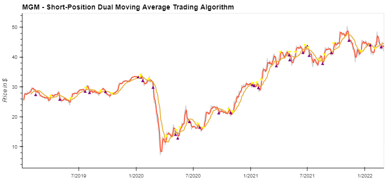
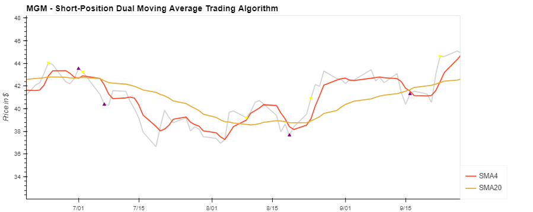
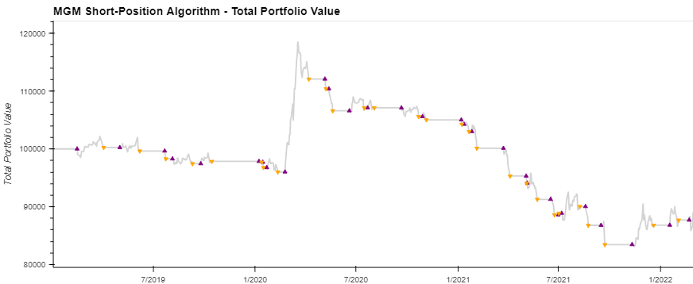

# Putting the Rhythm in Algorithym


## Overview
Created an algorithmic trading model to evaluate the success of the DMAC trading strategy. This was applied to MGM Resorts International stock listed on the NYSE, evaluating daily close prices of the date range of January 1st, 2019 through March 4th, 2022. The purpose of the study was to evaluate a company that has implemented a sportsbook app with which BetMGM is a part of the MGM Resorts International company.

## Package Requirements
```
conda create -n algotrading python=3.7 anaconda
conda activate algotrading
conda install -c pyviz hvplot
pip install finta
```
## Analysis Results
This code tests the profitability of a 4 day and a 20 day simple moving average with the DMAC trading strategy.

MGM stock data was pulled using Alpaca API.

```python
# Set the short_window and long window variables
short_window = 4
long_window = 20

# Generate the short and long moving averages
df_close['SMA4'] = df_close['Close'].rolling(window=short_window).mean()
df_close['SMA20'] = df_close['Close'].rolling(window=long_window).mean()
```


Zooming in on the graph I was able to view when the signals indicated a buy and a sell. With the DMAC trading strategy it will signal a buy when the STMA crosses below the LTMA due to the stock being said to be under-valued and vice versa with the STMA crossing above the LTMA then being over-valued.



In the given time period the estimated portfolio value fell from $100,000 to approximately $85,000.



## Conclusion

Utilizing the DMAC trading strategy on this particular stock was not valuable. I believe if I were to adjust my code and view variations of the results or the portfolio I could make this investment profitable but that would take longer than 2 weeks to implement. The second strategy also needed more time adjust the code to continue the technique into linear regression and to view the accuracy of that technique. I would utilize both techniques to valuate stocks for future endeavors.
